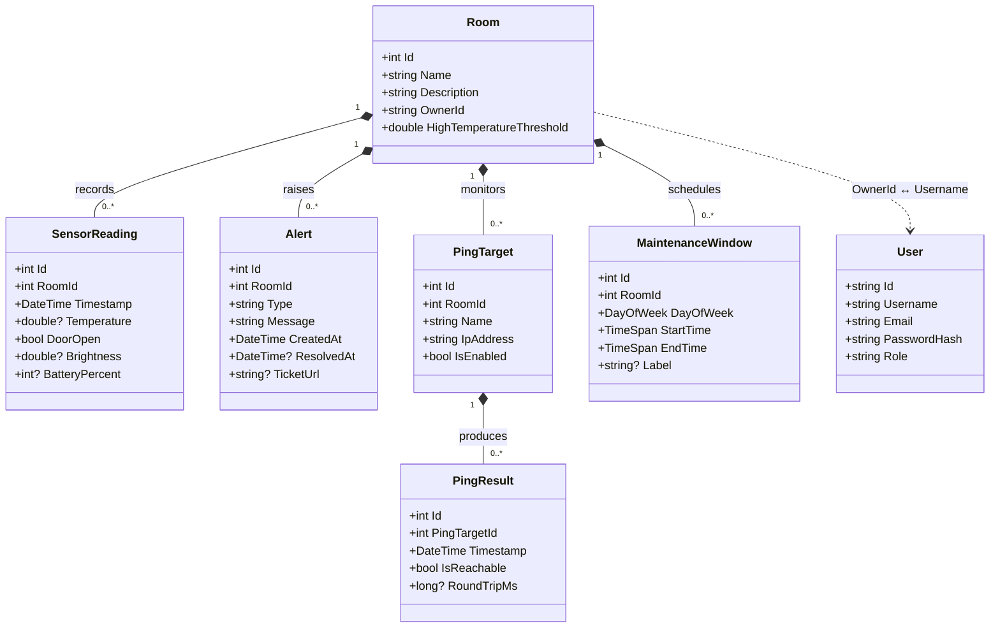
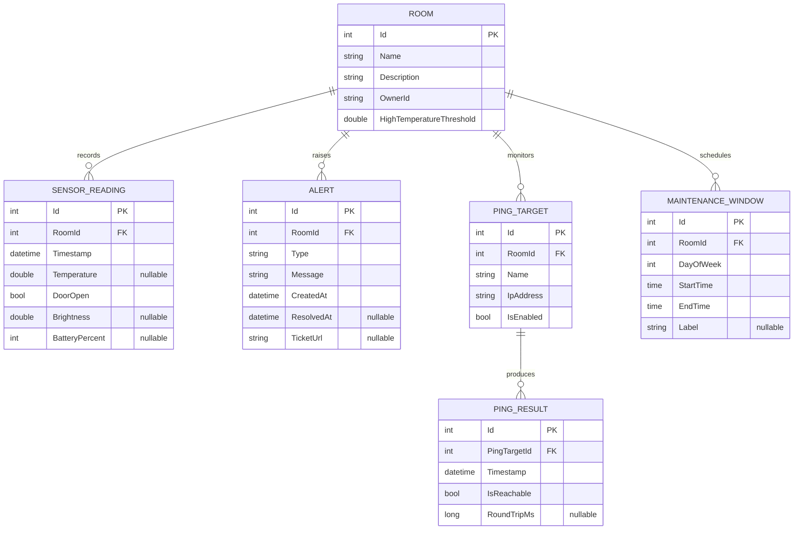
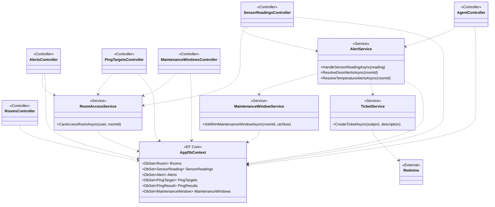
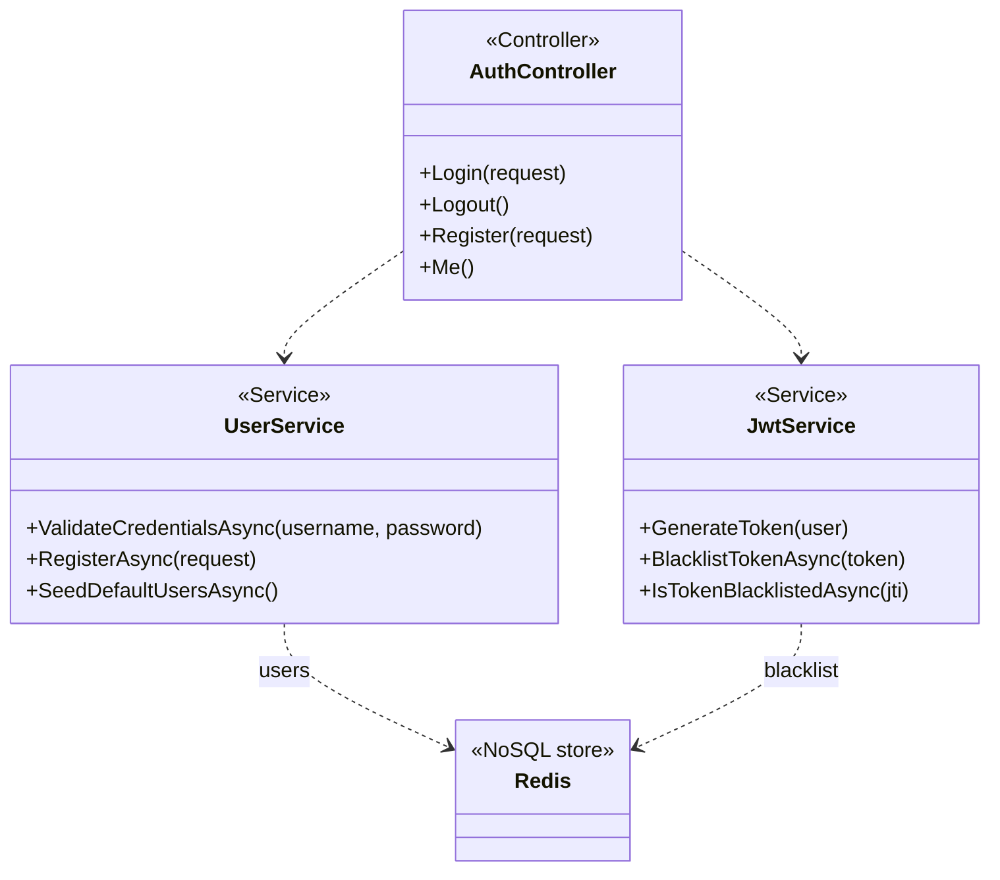

# Diagrams — ShellySpotter

UML class diagrams and the entity-relationship diagram for the ShellySpotter domain.
All diagrams use Mermaid and render directly on GitHub.

---

## 1. Domain Model (Class Diagram)

The core persistent entities and their relationships. `Room` is the aggregate root: every
sensor reading, alert, ping target and maintenance window belongs to exactly one room
(composition — children do not exist without their room). `User` lives in the separate
Token-MS (Redis) store and is linked only logically: a room's `OwnerId` matches a customer's
`Username`.

**Notes**
- `?` marks a nullable field (e.g. `Temperature` is null when a reading only reports door state).
- `Alert.Type` is a discriminator string: `"DoorOpenedOutsideMaintenance"` or `"TemperatureHigh"`.
- `User.Role` ∈ { `Customer`, `Employee`, `Admin`, `Agent` }.

---

## 2. Entity-Relationship Diagram (Database Schema)

The relational schema persisted in MSSQL (via EF Core). These are the six tables created by
the `InitialCreate` + `AddHighTemperatureThreshold` migrations. `User` is **not** shown here:
it lives in Redis (Token-MS), a NoSQL store, and is linked only logically via `Room.OwnerId`.

---

## 3. Application Architecture — Core-MS (Class Diagram)

How the Core-MS layers collaborate. Controllers depend on services and the `AppDbContext`; all
wiring is constructor-injected (ASP.NET Core DI). `RoomAccessService` centralises the per-tenant
authorization check used by every room-scoped controller (see threat model F1).

---

## 4. Authentication — Token-MS (Class Diagram)

Token-MS is a small, separate service backed by Redis: it issues and revokes JWTs and stores users.

