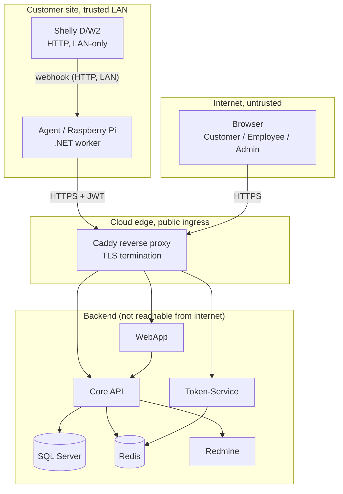

# Threat Model — ShellySpotter

We made this threat model using the four steps from the course
(*Introduction to threat modeling*):

This document presents a STRIDE-based threat model applied to our ShellySpotter platform. It identifies the
assets worth protecting, the trust boundaries data crosses, the threats against each element, and
the controls that mitigate them. It also records concrete vulnerabilities found during modelling
and how they were remediated (§7).

**In scope:** the four .NET services (Agent, Core-MS, Token-MS, WebApp), their data stores (MSSQL,
Redis), the Redmine ticket system, and the network/CI security around them.

**Out of scope (current iteration):** physical hardening of the Shelly device and the Raspberry Pi,
and the customer's local network — these are deployed at the customer site and assumed to sit on a
physically controlled, trusted LAN.

---

## Step 1: What we protect

### How the system works

The Agent always starts the connection itself. It asks Core for its config and
sends its reports. Core can never call back into the customer's network, so the
customer's firewall needs no open incoming port.

### What is worth protecting

- Room data (sensor and ping results). Only the owner should see it.
- User passwords (bcrypt hashes in Redis).
- The JWT signing secret. Anyone who has it can fake any login.
- The tokens themselves. A stolen token lets someone act as that user.
- The database and Redis passwords.
- Alerts and tickets (our record of what happened).
- The source code and the build pipeline.

### Trust boundaries

1. Internet to cloud edge: TLS and a JWT.
2. Cloud edge to backend: the backend is not open to the internet.
3. Shelly to Agent: plain HTTP, but only on the customer's own LAN.
4. Service to database or Redis: separate network and a password.

---

## Step 2 and 3: The threats and what we do

We went through the diagram with STRIDE and asked, for each part, "what could go
wrong, and how?". Each threat gets a decision. Accepting a small risk is fine
when fixing it is not worth it yet.

| What could go wrong, and how | STRIDE | Decision | What we do about it |
|------------------------------|--------|----------|---------------------|
| Someone fakes the Agent and sends false readings | Spoofing | Reduce | The Agent must send a valid JWT (role Agent) from the Token-Service |
| An attacker tries many passwords on the login | Spoofing | Reduce | Passwords are bcrypt-hashed. Rate limiting is still on our list |
| An attacker steals a token and reuses it | Spoofing | Reduce | Tokens expire after 8 h and logout blocks the token in Redis (F3) |
| An attacker puts SQL code into an API field | Tampering | Reduce | EF Core uses parameters, no raw SQL, input goes through DTOs |
| A user denies creating or closing an alert | Repudiation | Reduce | We log the time and the user; only staff can resolve alerts |
| A customer opens someone else's room by changing the roomId | Info disclosure | Reduce | RoomAccessService checks the owner on every room endpoint (F1) |
| The JWT secret or a database password leaks | Info disclosure | Reduce | Secrets stay in env vars, never in code. TruffleHog scans CI (F4) |
| An employee looks at customer data they do not need | Info disclosure | Accept | Small trusted team, roles checked, actions logged |
| A door event creates a new ticket every few seconds | Denial of service | Reduce | No new ticket while one is already open for that room |
| A customer edits the role in their token to become Admin | Elevation of priv. | Reduce | The role is signed, so changing it breaks the signature |

---

## Step 4: Build it and review it

### Four real problems we found and fixed

While making this model we found four real issues. We fixed all four and tested
them on the running system, because a fix only counts once you check it works.

- **F1, broken access control.** Only the room list checked the owner, so a
  customer could open another customer's room by changing the roomId. We added
  RoomAccessService to every room endpoint. Tested: own room gives 200, someone
  else's gives 403.
- **F2, token claims broke isolation.** .NET renamed the `sub` claim, so the owner
  check compared against an empty value. We set `MapInboundClaims=false` with
  explicit claim types. Tested: a customer now sees only their own room.
- **F3, logout did not really log out.** A copied token kept working for 8 hours.
  Now logout puts the token id on a Redis blocklist and both services check it.
  Tested: after logout the same token gives 401.
- **F4, a real secret in the local clone.** Our TruffleHog scan found a real
  GitHub token in `.git/config` on the first run. We revoked it and moved to the
  OS keychain. A good example of why the CI secret scan helps.

### Risks we accept for now

- No rate limiting yet. Login uses bcrypt and every API needs a token. Planned next.
- The Shelly webhook is not authenticated. It only runs on the customer's own LAN.
- One shared JWT secret for all services. Fine at our size; we can rotate it later.
- The database still uses the `sa` account. We want to give the app its own user later.

### Review

A threat model is never really finished. The app and the users change over time.
We review this model whenever we change the architecture, the endpoints, or the
security parts.

Last reviewed: 2026-06-26.
