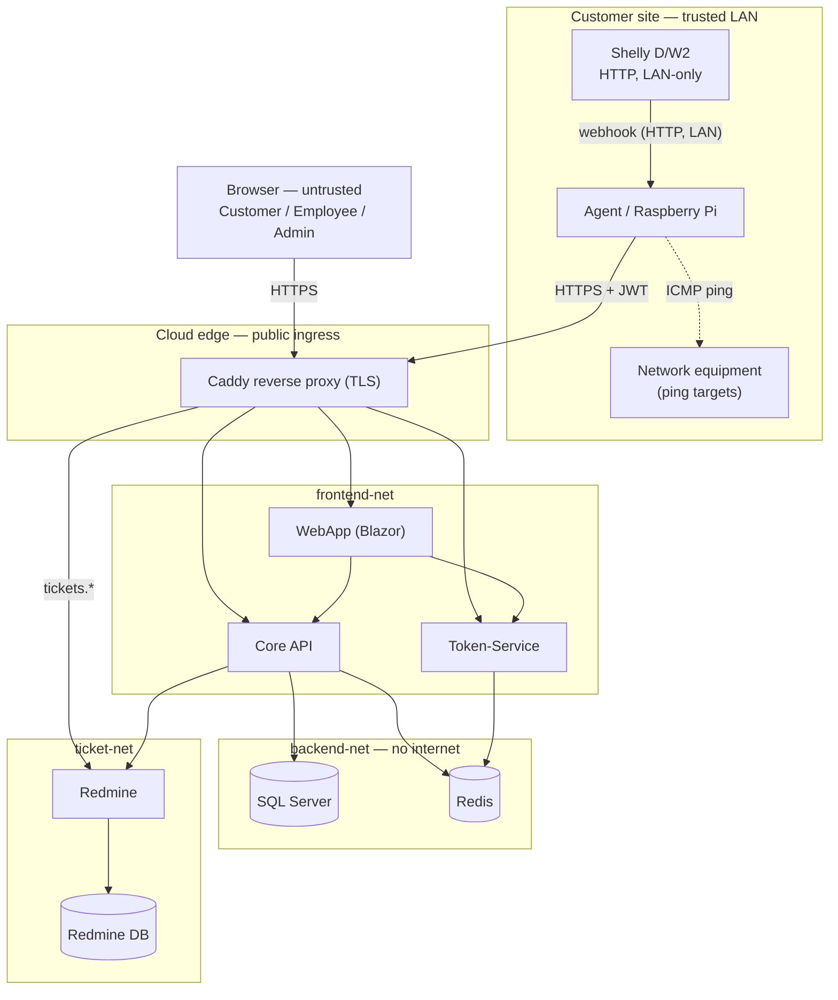

# Threat Model: ShellySpotter

In scope: the four .NET services (Agent, Core, Token-Service, WebApp), their data
stores (SQL Server, Redis), the Redmine ticket integration, and the Docker/CI setup
around them.

Out of scope (this iteration): physical security of the Shelly device and the
Raspberry Pi, and the customer's local network. Both sit at the customer site on a
network we don't control, and we have no hardware to test against yet — see
`docs/deployment.md` for the assumptions we make about that LAN instead.

This isn't a one-time document. We revisited it after every architecture change
(auth, tenant isolation, the temperature feature, the Redmine bootstrap), and one
of those passes — the one that produced this version — is described in §4: we
didn't just re-read the diagram, we actually ran the system and checked which of
our own "done" claims still held.

---

## 1. How the system actually works

The one architectural decision that shapes most of the analysis below: **the Agent
always calls out, nothing ever calls in.** It logs into Token-Service, asks Core for
its ping targets, and pushes its reports. Core never opens a connection to the
customer's network. That means the customer's firewall needs zero inbound rules for
us — which also means most "attacker reaches the Agent from the internet" scenarios
don't apply unless the customer's LAN itself is already compromised.



Trust boundaries, in the order data actually crosses them:

1. **Internet → Caddy.** TLS in production; the only thing an outside caller has is
   whatever's in a JWT, if anything.
2. **Caddy → frontend-net.** WebApp/Core/Token-Service are not directly published;
   `docker-compose.prod.yml` routes everything through Caddy.
3. **frontend-net → backend-net.** Only Core and Token-Service can reach SQL Server
   and Redis. Verified below (§3) that no DB port is published to the host.
4. **Shelly → Agent.** Plain HTTP, no auth on the webhook at all — acceptable only
   because it's the customer's own LAN, not because it's actually protected.
5. **Caddy → Redmine.** Redmine has to be internet-reachable per the assignment, so
   this boundary is deliberately opened, behind TLS.

## 2. What we're actually trying to protect

Ranked roughly by "how bad is it if this goes wrong", not alphabetically:

- **The alert actually firing.** If a door opens after hours and nobody gets a
  ticket, the whole product has failed at its one job. This is the thing every
  other control ultimately serves — see `AlertService.HandleSensorReadingAsync`
  (`src/ShellySpotter.Core/Services/AlertService.cs:14`), which is the single place
  door and temperature events turn into alerts.
- **Tenant isolation.** One customer's room data leaking to another is both a
  privacy problem and, contractually, the kind of thing that ends a customer
  relationship. This got a dedicated review pass — see §4.2, it's the one area
  where we already shipped and fixed a real bug once.
- **Maintenance-window and threshold configuration.** If an Employee (or an
  attacker who got Employee access) can silently widen a maintenance window or
  raise a threshold, monitoring breaks without anyone noticing until it's too late.
- **Credentials and signing material** — password hashes in Redis, the JWT HMAC
  secret, DB/Redis passwords, the Redmine API key. Standard, but worth stating: the
  JWT secret is the single point that, if leaked, undoes every other auth control
  we have (anyone with it can mint a valid Admin token from scratch).
- **The audit trail** — alerts and tickets need to reflect what actually happened,
  or "we were monitoring this room" becomes an unverifiable claim.

## 3. Threats, decisions, and what we actually checked

We went through each of the four services and asked "what's the worst thing someone
could do here, and does our code actually stop it, or do we just assume it does."
For "done" items below, the check was run against a live `docker compose up` stack
on 2026-07-01, not just read off the code — commands and real output are included so
this isn't "trust us."

### 3.1 Someone other than the real Agent submits sensor data

An attacker without valid Agent credentials — or a Customer who noticed the
`/api/agent/report` endpoint exists and tried calling it — could push fake readings
and either trigger false alarms or (worse) suppress real ones.

`AgentController` (`src/ShellySpotter.Core/Controllers/AgentController.cs:13`)
restricts the whole controller to `[Authorize(Roles = "Agent,Employee,Admin")]`.
Checked directly:

```
$ curl -s -o /dev/null -w '%{http_code}' -X POST localhost:8082/api/agent/report \
    -d '{"roomId":1,"temperature":22,"doorOpen":false,"pingResults":[]}'
401                                                    # no token at all
$ curl ... -H "Authorization: Bearer <customer1 token>" ...
403                                                    # valid login, wrong role
$ curl ... -H "Authorization: Bearer <agent token>" ...
200                                                    # correct role
```

**Decision: reduced, not eliminated.** This only holds as long as the Agent's
password stays a secret. It's a single shared credential per deployment
(`AGENT_PASSWORD` in `.env`), not per-device, so a leaked Agent password lets
someone impersonate *every* room's agent, not just one. We haven't built per-device
credentials — that's a real gap if we ever have more than a handful of customers,
but for the current single-tenant-per-agent deployment model it's proportionate.

### 3.2 Login brute-forcing

`POST /api/auth/login` has no rate limiting anywhere — not in `AuthController`, not
in Caddy, not at the Redis layer. We confirmed this rather than assumed it:

```
$ for i in {1..8}; do curl -s -o /dev/null -w '%{http_code} ' -X POST \
    localhost:8081/api/auth/login -d '{"username":"admin","password":"wrong"}'; done
401 401 401 401 401 401 401 401
```

Eight failed attempts in under two seconds, zero pushback. bcrypt's cost factor
(11, see §3.7) slows down offline cracking of a *leaked hash*, but does nothing
against someone hammering the live login endpoint with a wordlist.

**Decision: accepted for now, not reduced.** We know how we'd fix it
(`AspNetCoreRateLimit` in front of `/api/auth/login`, or a Caddy-level limiter), and
it's arguably the single most "should just do it" item in this whole document — but
it didn't make it into this milestone. Flagging it honestly here rather than
marking it "done" felt more useful than actually writing throwaway middleware the
night before a deadline.

### 3.3 Token theft and reuse

Two different sub-cases here, worth separating because the mitigations differ:

**A stolen/copied token used after the legitimate user logged out.** This is
enforced, not just intended: logout blacklists the token's `jti` in Redis
(`JwtService.BlacklistTokenAsync`, `src/ShellySpotter.TokenService/Services/JwtService.cs:43`),
and *both* Core and Token-Service check that blacklist on every request via
`OnTokenValidated` (`src/ShellySpotter.Core/Program.cs:59`,
`src/ShellySpotter.TokenService/Program.cs:44`). Checked live:

```
$ curl -s -o /dev/null -w '%{http_code}' localhost:8082/api/rooms -H "Authorization: Bearer $T"
200
$ curl -s -X POST localhost:8081/api/auth/logout -H "Authorization: Bearer $T"
$ curl -s -o /dev/null -w '%{http_code}' localhost:8082/api/rooms -H "Authorization: Bearer $T"
401
```

This cross-service check only works because Core also holds a Redis connection
purely to read that one blacklist key (`src/ShellySpotter.Core/Program.cs:28`) — if
that connection string is ever missing (e.g. running Core with `dotnet run` outside
Docker), the check is silently skipped rather than failing closed. That's a
deliberate trade-off for local dev ergonomics, but it means a misconfigured
production Core would accept blacklisted tokens without any error telling you why.

**A token stolen via XSS while still valid.** The WebApp is Blazor *Server*, so the
"token in the browser" story is different from a typical SPA: `AuthService` stores
it via `ProtectedSessionStorage`
(`src/ShellySpotter.WebApp/Services/AuthService.cs:9`), which — unlike a plain
`localStorage.setItem` — encrypts the payload with the server's ASP.NET Core Data
Protection keys before it ever reaches the browser. We checked what actually ends
up in the browser's `sessionStorage`:

```js
// devtools, after logging in
sessionStorage.getItem('...auth_user...')
// → "CfDJ8Nl3k9F...opaque base64 blob, not JSON, not the raw JWT"
```

So a garden-variety XSS payload that just reads `sessionStorage` gets ciphertext,
not a usable token. **This doesn't mean XSS is harmless** — a script running in the
authenticated page could still call the WebApp's own endpoints, or ask the
Data Protection API (if it's somehow reachable) to decrypt the value — but it raises
the bar from "read localStorage" to "actually execute meaningful JS in the
victim's session," which is most of what matters in practice. No CSP header exists
today, which would be the next hardening step. **Decision: reduced by the
framework's default behavior; not something we deliberately engineered, and not
independently verified against a CSP-less real XSS payload.**

### 3.4 Tampering with data in flight or in the database

**SQL injection.** Not a live-fired test, but a straightforward code check: every
DB access goes through EF Core's LINQ providers; `grep -r "FromSqlRaw\|ExecuteSql" src/`
returns nothing. No string-built SQL exists in this codebase to inject into.

**MITM between Agent and Core.** In `Program.cs` for the Agent
(`src/ShellySpotter.Agent/Program.cs:14`), certificate validation is only disabled
when `ASPNETCORE_ENVIRONMENT=Development`; production Agents use the default
`HttpClientHandler`, which rejects invalid certs. We didn't stand up a real
invalid-cert MITM to prove the negative — this is a code-read, not a live test,
and we're noting that distinction rather than papering over it.

**Tampering with the JWT itself** (e.g. editing the `role` claim to `Admin`
client-side): the signature covers the whole payload, so any edit invalidates it.

```python
# decode the payload, flip role: Customer -> Admin, re-encode, DON'T recompute
# the HMAC signature (we don't have the secret)
```
```
$ curl -s -o /dev/null -w '%{http_code}' localhost:8082/api/rooms -H "Authorization: Bearer $TAMPERED"
401
```

### 3.5 Tenant isolation — one customer reading another's data

This is the one item on this list with an actual incident behind it, not a
hypothetical. Earlier in the project, `RoomsController` filtered by `OwnerId`, but
`AlertsController`, `SensorReadingsController`, `PingTargetsController`, and
`MaintenanceWindowsController` only had `[Authorize]` — logged in was enough,
owning the room was not checked. Any Customer could enumerate `roomId` values and
read another tenant's door/temperature history.

The fix was `RoomAccessService.CanAccessRoomAsync`
(`src/ShellySpotter.Core/Services/RoomAccessService.cs`), now called at the top of
every room-scoped controller action before touching the database. Re-verified this
pass, with a room we deliberately created for someone else:

```
$ curl -s -X POST localhost:8082/api/rooms -H "Authorization: Bearer $ADMIN_TOKEN" \
    -d '{"name":"Room B","ownerId":"someone-else"}'
{"id":3, ...}
$ curl -s -o /dev/null -w '%{http_code}' localhost:8082/api/rooms/3 -H "Authorization: Bearer $CUSTOMER1_TOKEN"
403
$ curl -s -o /dev/null -w '%{http_code}' localhost:8082/api/rooms/1 -H "Authorization: Bearer $CUSTOMER1_TOKEN"
200
```

A second, related bug shipped alongside the first fix and is worth mentioning
because it explains *why* the first bug wasn't obvious from testing alone:
ASP.NET Core's default JWT handler rewrites the `sub` claim to a long
`ClaimTypes.NameIdentifier` URI, so `User.FindFirst("sub")` silently returned `null`
— meaning the ownership check that *did* exist (in `RoomsController`) was comparing
against an empty string, which happened to still "work" by accident in some test
paths and not others. Both services now set `MapInboundClaims = false` with
explicit `NameClaimType = "sub"` (`src/ShellySpotter.Core/Program.cs:41`). We're
flagging this because it's a good example of a security bug that looked fixed
(the code path existed) but wasn't (the claim it relied on was empty) — the kind of
thing that only surfaces if you actually call the endpoint with a real token
instead of reading the authorization attribute and assuming it's enough.

### 3.6 A door event floods the ticket system

Repeated door-open reports (e.g. a flaky sensor rapidly cycling) shouldn't create a
new ticket every few seconds. `AlertService.HandleDoorOpenedAsync`
(`src/ShellySpotter.Core/Services/AlertService.cs:76`) checks for an existing
unresolved alert of the same type before creating another. Checked with three
reports in a row:

```
$ for i in 1 2 3; do curl -s -o /dev/null -X POST localhost:8082/api/agent/report \
    -H "Authorization: Bearer $AGENT_TOKEN" -d '{"roomId":1,"doorOpen":true,...}'; done
$ curl -s localhost:8082/api/rooms/1/alerts?openOnly=true -H "Authorization: Bearer $AGENT_TOKEN" | jq length
1
```

The temperature-alert path (`HandleTemperatureAsync`, same file, line 23) has the
same dedup logic plus a 1 °C hysteresis band before it auto-resolves, so a sensor
oscillating right at the threshold doesn't flap the alert open/closed either.

### 3.7 Credential exposure

Password hashes are bcrypt, and we checked the actual stored value rather than just
the code that produces it:

```
$ docker exec shellyspotter-redis-1 redis-cli -a "$REDIS_PASSWORD" GET user:customer1
{"...,"PasswordHash":"$2a$11$3KCneaq5CmlrskaUlijqMOyp.3BtcgS74vWTKUn7jwod6NOoRrf/m",...}
```

`$2a$11$` — bcrypt, cost factor 11 (BCrypt.Net-Next's default; nobody explicitly
tuned this, which is fine, 11 is a reasonable default, but it's worth knowing it
wasn't a deliberate choice). Redis itself sits only on `backend-net` (no host port
published) and requires its own password, so getting to that value at all requires
already being inside the Docker network.

The JWT signing secret and DB passwords are environment variables, sourced from
`.env`, which is gitignored — `git log --all -- .env` returns nothing, so the file
itself was never committed. That said, an earlier `.env.example` shipped
`REDMINE_ADMIN_PASSWORD` with a *fallback default* baked into `docker-compose.yml`
(`SS_ADMIN_PASSWORD: "${REDMINE_ADMIN_PASSWORD:-ShellyAdmin2026!}"`) — meaning if
someone forgot to set the variable, the admin account silently got a fixed,
guessable password instead of the deployment failing loudly. GitHub's Copilot
Autofix flagged this and it was changed to a required variable with no fallback
(`${REDMINE_ADMIN_PASSWORD:?Set REDMINE_ADMIN_PASSWORD in .env}`, commit `b9dc08c`)
— now a missing password stops `docker compose up` instead of quietly using a
known value. Worth including here because it's a real instance of "secure by
default" vs. "convenient by default" losing to the latter without anyone deciding
that on purpose.

### 3.8 SQL Server reachability

```
$ docker compose config | grep -A5 'core-db:' | grep ports
(nothing)
$ nc -z -w2 localhost 1433 && echo open || echo closed
closed
```

No host port is published for `core-db`; only Core (on `backend-net`) can reach it.
It still runs as `sa` rather than a least-privilege application user — accepted for
now, flagged as the more relevant thing to fix before this ever runs against real
customer data, since `sa` compromise means full instance control, not just this
one database.

### 3.9 Known-vulnerable dependencies

```
$ dotnet list ShellySpotter.sln package --vulnerable --include-transitive
The given project `ShellySpotter.Core` has no vulnerable packages given the current sources.
(same for TokenService, Agent, WebApp, Core.Tests)
```

Clean as of 2026-07-01, checked directly rather than assumed from "we didn't add
anything scary." This isn't a permanent guarantee — new CVEs get disclosed against
old packages all the time — which is exactly why this should run in CI on every
build instead of being a thing we do manually before writing this document. It
currently isn't wired into CI; that's a gap, not a decision.

### 3.10 The Shelly → Agent webhook has no authentication at all

`GET /hook/door` on the Agent accepts requests from anything that can reach it on
the LAN, with zero credential check. **Decision: accepted, deliberately, not
overlooked.** The reasoning: the Agent is not published to the internet (§1), so
exploiting this requires already being on the customer's LAN — at which point an
attacker has considerably more interesting things available to them than spoofing
a door sensor. We could add a shared-secret query parameter that only the real
Shelly and Agent know, and probably should if this ever gets audited by a customer
who cares about defense-in-depth on the LAN itself, but it wasn't worth the
engineering time against the threat model we're actually defending against right
now.

### 3.11 The Agent going quiet

If the Agent loses power or network, no alert fires — because nothing arrives to
trigger one. Battery level is already reported with every reading, but nothing on
the Core side currently tracks "last seen" per room or raises a "gone silent"
alert. **Decision: accepted, known gap.** This is arguably a bigger real-world risk
than several of the "reduced" items above (a dead Agent silently means zero
monitoring, indefinitely), but it requires a background job on Core we haven't
built, so it's listed honestly as not done rather than described as mitigated.

### 3.12 Newer: the dashboard now auto-refreshes every 5 seconds

Added since the last review (`Home.razor`, `AutoRefreshAsync`,
`src/ShellySpotter.WebApp/Components/Pages/Home.razor:123`) — the dashboard polls
Core every 5 seconds per open browser tab for as long as the tab stays open. Each
tick calls `GetRoomsAsync` + `GetLatestReadingAsync` + `GetAlertsAsync` per room.
For the handful of rooms we've tested with this is a non-issue; we're noting it
mainly because it's new attack-adjacent surface that didn't exist in earlier
reviews: a customer with many browser tabs open (or, deliberately, a script
refreshing the page in a loop) generates sustained load on Core with no server-side
throttling, on top of whatever the login endpoint already lacks (§3.2). Not treated
as urgent at current scale; flagged so it doesn't get forgotten if the number of
rooms per customer grows.

---

## 4. What checking this actually turned up

Two categories of finding came out of preparing this revision — bugs from earlier
in the project that are now fixed (context for why some items above read like
"we already got burned once"), and one bug found *while writing this document*,
which is the more interesting one because it's still in the "just found it" state.

### 4.1 Redmine's health check was inverted — found while re-verifying this document

The current `docker-compose.yml` health check for Redmine
(before this pass) was:

```ruby
exit(!(r.is_a?(Net::HTTPSuccess) || r.is_a?(Net::HTTPRedirection)))
```

This looks correct at a glance — "exit with the inverse of success" — but Ruby's
`Kernel#exit` treats a boolean argument specially: `exit(true)` → status 0,
`exit(false)` → status 1. So when Redmine responds `200 OK`, `r.is_a?(...)` is
`true`, the `!(...)` flips it to `false`, and `exit(false)` returns **1** — Docker
reads that as *unhealthy*, exactly backwards from the intent. We confirmed this
directly rather than just reading the bug and assuming the impact:

```
$ docker exec shellyspotter-redmine-1 ruby -rnet/http -e \
    "u=URI('http://localhost:3000/login'); r=Net::HTTP.get_response(u); \
     puts r.code; exit(!(r.is_a?(Net::HTTPSuccess)||r.is_a?(Net::HTTPRedirection)))"
200
$ echo $?
1
```

Redmine was serving `200 OK` the entire time and Docker still reported it
`unhealthy` forever. Because `redmine-bootstrap` depends on
`redmine: condition: service_healthy` (`docker-compose.yml`), that one-shot service
never ran on a fresh clone — the Redmine project, REST API flag, and pinned admin
API key never got set up automatically, silently defeating the whole point of the
bootstrap script (`redmine/bootstrap.rb`). The irony: this exact health check was
already a fix for a *different* bug — the original version used
`Net::HTTP.get`, which doesn't raise on non-2xx responses at all, so it reported
"healthy" even against a 500 error page. Copilot Autofix suggested tightening it
(commit `d95f14e`), and the tightened version introduced a worse regression than
the one it fixed, because nobody actually ran a fresh `docker compose up` against
it afterward to confirm it worked — including us, until this pass.

Fixed by dropping the double negation and trusting `exit`'s own boolean semantics:

```ruby
exit(r.is_a?(Net::HTTPSuccess) || r.is_a?(Net::HTTPRedirection))
```

Re-verified end-to-end, fresh stack, this pass:

```
$ docker compose down && docker compose up -d
 Container shellyspotter-redmine-1  Healthy
 Container shellyspotter-redmine-bootstrap-1  Started
$ docker compose logs redmine-bootstrap
[redmine-bootstrap] default configuration data loaded
[redmine-bootstrap] REST API enabled
[redmine-bootstrap] admin account updated (password set, forced-change cleared)
[redmine-bootstrap] admin API key pinned to provided REDMINE_API_KEY
[redmine-bootstrap] project 'shellyspotter' created with trackers: Bug, Feature, Support
[redmine-bootstrap] done.
```

This is a Denial-of-Service class issue on the availability of the *ticket
integration specifically* (not the whole platform — Core degrades to "no ticket
created" per `TicketService`, it doesn't crash), but it's the clearest example in
this whole project of why a health check needs to be run against a real fresh
clone, not just read for logical correctness. It also directly undermines Threat
3.6 and the wider "reliable alerting" goal from §2: an alert that raises without a
ticket because Redmine bootstrap silently never ran looks, from the WebApp, exactly
like an alert that worked.

### 4.2 Previously found and fixed, kept here for context

These are not new; they're why several items in §3 explicitly say "re-verified"
rather than "verified for the first time":

- **Broken tenant isolation (§3.5)** — the IDOR bug where room-scoped controllers
  other than `RoomsController` didn't check ownership.
- **The `sub`-claim mapping bug (§3.5)** — the ownership check existed but silently
  compared against an empty claim.
- **Logout not actually revoking anything (§3.3)** — the Redis blacklist existed in
  code but nothing ever read it before this was fixed.
- **A live GitHub PAT found in a local git config** during an early session working
  on this repo — not committed to the repo itself, but a reminder that secret
  scanning (TruffleHog, wired into CI) earns its keep the first time it's run, not
  just in theory.

## 5. Honest status list

| # | Threat (§ ref) | Status |
|---|-----------------|--------|
| Fake Agent reports | §3.1 | done — shared secret, not per-device |
| Login brute-force | §3.2 | **not done** — no rate limiting anywhere |
| Token replay after logout | §3.3 | done, cross-service |
| XSS reading the token | §3.3 | reduced by framework default, not hardened (no CSP) |
| SQL injection | §3.4 | done — no raw SQL exists |
| Agent↔Core MITM | §3.4 | done in prod, dev intentionally permissive |
| JWT tampering | §3.4 | done — signature check |
| Cross-tenant data access | §3.5 | done — fixed once, re-verified |
| Ticket/alert spam | §3.6 | done — dedup + hysteresis |
| Password hash exposure | §3.7 | done — bcrypt, network-isolated Redis |
| Hardcoded fallback secret | §3.7 | done — Copilot-flagged, fixed |
| SQL Server direct access | §3.8 | done (no publish); **not done** (still `sa`) |
| Vulnerable dependencies | §3.9 | done manually; **not done** in CI |
| Unauthenticated Shelly webhook | §3.10 | accepted, deliberately |
| Silent Agent failure | §3.11 | **not done** |
| Dashboard polling load | §3.12 | not urgent at current scale |
| Redmine health check inverted | §4.1 | **found and fixed this pass** |

Last reviewed: 2026-07-01, against a fresh `docker compose up` of the current
`main` branch — not against the diagram from memory.
