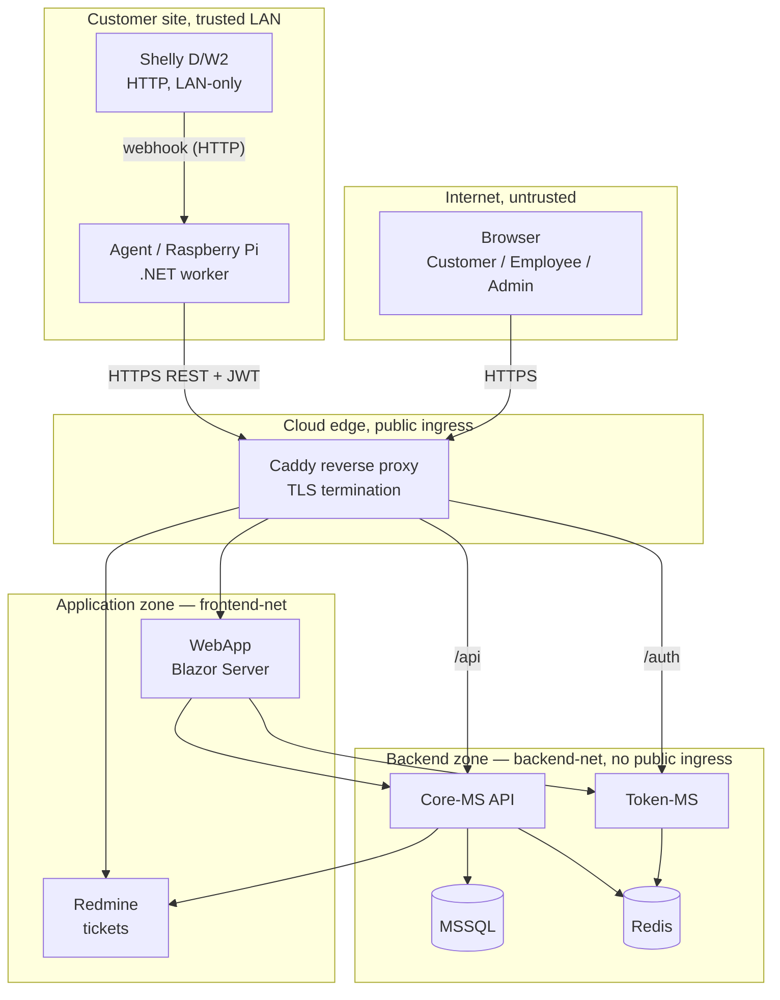

# Threat Model — ShellySpotter

## 1. Purpose & Scope

This document presents a STRIDE-based threat model applied to our ShellySpotter platform. It identifies the
assets worth protecting, the trust boundaries data crosses, the threats against each element, and
the controls that mitigate them. It also records concrete vulnerabilities found during modelling
and how they were remediated (§7).

**In scope:** the four .NET services (Agent, Core-MS, Token-MS, WebApp), their data stores (MSSQL,
Redis), the Redmine ticket system, and the network/CI security around them.

**Out of scope (current iteration):** physical hardening of the Shelly device and the Raspberry Pi,
and the customer's local network — these are deployed at the customer site and assumed to sit on a
physically controlled, trusted LAN.

---

## 2. Assets

| # | Asset | Why it matters |
|---|-------|----------------|
| A1 | Sensor & ping data per room | Customer's operational data; confidentiality (tenant isolation) + integrity |
| A2 | User credentials (bcrypt hashes in Redis) | Account takeover if leaked |
| A3 | JWT signing secret (HMAC key) | Whoever holds it can forge any identity/role |
| A4 | Access tokens (JWTs) | Bearer tokens → impersonation if stolen |
| A5 | Database / Redis connection secrets | Full data access |
| A6 | Alerts & tickets | Integrity & non-repudiation of the security audit trail |
| A7 | Redmine API key | Ticket-system access |
| A8 | Source repository & build pipeline | Supply-chain integrity |

---

## 3. Architecture & Trust Boundaries

A key architectural property: **the Agent initiates every connection** (it pulls config and pushes
reports). The Core never connects inbound to the Agent, so the customer firewall needs no inbound
rule — the Agent stays unreachable from the internet.



**Trust boundaries crossed (where threats concentrate):**

1. Internet → Cloud edge (browser/Agent → Caddy): TLS, JWT auth.
2. Caddy → Backend: only the edge may reach `backend-net`; services are not published to the host except via the proxy.
3. Shelly → Agent (LAN): unauthenticated HTTP webhook on a trusted network.
4. Service → data store (Core→MSSQL, Token/Core→Redis): network-segmented, password-authenticated.

---

## 4. Data Flows

| DF | Flow | Channel | Auth |
|----|------|---------|------|
| DF1 | Shelly → Agent (door/temp event) | HTTP webhook on LAN | none (LAN trust) |
| DF2 | Agent → Token-MS (login) | HTTPS | username/password → JWT |
| DF3 | Agent → Core-MS (report, fetch targets) | HTTPS | JWT (role=Agent) |
| DF4 | Browser → Token-MS (login/logout) | HTTPS | password / Bearer |
| DF5 | Browser/WebApp → Core-MS (rooms, alerts, config) | HTTPS | JWT (role-scoped) |
| DF6 | Core-MS → Redmine (create ticket) | HTTP (internal) | Redmine API key |
| DF7 | Core-MS / Token-MS → Redis (blacklist, users) | internal | Redis password |
| DF8 | Core-MS → MSSQL | internal | connection string |

---

## 5. STRIDE Analysis

Risk = rough Likelihood × Impact (L / M / H). "Status" links to the remediation in §7 where relevant.

### 5.1 Spoofing

| Asset/Flow | Threat | Risk | Mitigation | Status |
|---|---|---|---|---|
| Agent identity (DF3) | Attacker impersonates Agent to inject fake readings | M | Agent authenticates with JWT (role=Agent) from Token-MS; only known endpoints accept Agent role | ✅ |
| User login (DF4) | Brute-force / credential stuffing on Token-MS | M | bcrypt hashing; **rate limiting still missing** | ⚠️ residual (R1) |
| JWT tokens (A4) | Stolen token reused for API access | H | 8 h expiry; **logout now revokes the JTI via Redis and Core enforces it**; HTTPS only | ✅ Fixed (F3) |
| Shelly webhook (DF1) | LAN host calls `/hook/door` to inject readings | L | LAN is trusted; can add a shared-secret query token to the webhook URL | ⚠️ residual (R5) |

### 5.2 Tampering

| Asset/Flow | Threat | Risk | Mitigation | Status |
|---|---|---|---|---|
| Reports in transit (DF3) | MITM Agent↔Core | M | HTTPS; certificate validation enforced in production (Agent accepts self-signed only in Development) | ✅ |
| DB records (A1) | SQL injection via API inputs | H | EF Core parameterized queries; no raw SQL; DTO binding | ✅ |
| Request integrity | Mass-assignment / over-posting | M | Inbound DTOs expose only safe fields; entities never bound directly | ✅ |

### 5.3 Repudiation

| Asset | Threat | Risk | Mitigation | Status |
|---|---|---|---|---|
| Alerts (A6) | Dispute over who created/resolved an alert | L | `CreatedAt`/`ResolvedAt` timestamps; authenticated user logged; resolve restricted to Employee/Admin | ✅ |
| Tickets (A6) | Disputed ticket origin | L | Redmine records creator; Core logs the ticket URL on the alert | ✅ |

### 5.4 Information Disclosure

| Asset | Threat | Risk | Mitigation | Status |
|---|---|---|---|---|
| Tenant data (A1) | Customer A reads Customer B's room data (IDOR) | **H** | **`RoomAccessService` enforces owner check on every room-scoped endpoint** | ✅ Fixed (F1) |
| Identity claims | `sub`/`role` claims silently dropped → isolation bypassed/broken | **H** | **`MapInboundClaims=false` + explicit `NameClaimType`/`RoleClaimType`** | ✅ Fixed (F2) |
| JWT secret (A3) | Secret leak → forge any token | H | Env var / Docker secret; never in source | ✅ |
| DB/Redis secrets (A5) | Connection string leak | H | Env vars only; `appsettings.json` holds no secrets; `.env` git-ignored | ✅ |
| Credentials in VCS | Secret accidentally committed | M | **TruffleHog secret scan in CI** (see §6) | ✅ Added (F4) |
| Password hashes (A2) | Redis dump exposes passwords | M | bcrypt (BCrypt.Net-Next default cost factor 11); Redis password-protected, backend-net only | ✅ |

### 5.5 Denial of Service

| Asset | Threat | Risk | Mitigation | Status |
|---|---|---|---|---|
| Core-MS API | Flood of reports from a rogue/compromised agent | M | JWT required; **rate limiting still missing** | ⚠️ residual (R1) |
| Ticket system | Spam tickets on every door event | M | Duplicate suppression: no new alert/ticket while an open one exists for that room | ✅ |
| MSSQL | Unbounded data growth | L | `limit` params on reads; readings/ping results prunable | ⚠️ residual (R2) |

### 5.6 Elevation of Privilege

| Asset | Threat | Risk | Mitigation | Status |
|---|---|---|---|---|
| Customer → higher role | Tamper role inside JWT | H | Role is a signed claim; tampering breaks the HMAC signature | ✅ |
| Employee → Admin | Call Admin-only endpoints | M | `[Authorize(Roles=...)]` on privileged actions (create/delete rooms, register users) | ✅ |
| Agent → management | Agent token used for config/management | M | Agent role separate; management endpoints require Employee/Admin | ✅ |
| Cross-tenant via sub-resource | Customer reaches another room's alerts/readings/targets by changing `roomId` | **H** | Owner check centralised in `RoomAccessService`; target-in-room verified for ping results | ✅ Fixed (F1) |

---

## 6. Supply-Chain & CI Security

Added in `.github/workflows/ci.yml` (runs on every push to `main` and every PR):

- **Build gate** — the full solution must restore and build in Release.
- **Secret scanning** — TruffleHog scans the working tree (`--only-verified`, so demo passwords in
  `.env.example` don't false-positive; `.git`/`bin`/`obj` excluded). Fails the build on a *verified*
  live secret.
- **SBOM** — CycloneDX generates a Software Bill of Materials (133 NuGet components) and uploads it
  as a build artifact, giving a dependency inventory for vulnerability tracking.

---

## 7. Findings & Remediations

Threat modelling surfaced four concrete issues; all were fixed and verified end-to-end against a
running stack.

### F1 — Broken Object-Level Authorization (IDOR) — *Critical*
**Found:** Only `RoomsController` filtered by owner. `Alerts`, `SensorReadings`, `PingTargets` and
`MaintenanceWindows` carried just `[Authorize]`, so any authenticated customer could read another
tenant's room by changing the `roomId` in the URL. Violates the spec's "customers see only their own
data" (STRIDE: Information Disclosure / EoP).
**Fixed:** Introduced `RoomAccessService.CanAccessRoomAsync` and called it on every room-scoped read;
ping-result reads additionally verify the target belongs to the room.
**Verified:** customer1 → own room `200`, → foreign room `403`.

### F2 — JWT claim mapping broke identity checks — *High*
**Found:** .NET's default inbound claim mapping rewrote `sub`→`nameidentifier`, so
`User.FindFirst("sub")` returned `null` and the customer ownership filter compared against an empty
id — silently breaking tenant isolation.
**Fixed:** `MapInboundClaims=false` with explicit `NameClaimType="sub"` / `RoleClaimType="role"` in
both Core-MS and Token-MS; removed a now-redundant duplicate role claim.
**Verified:** customer login returns exactly the owned room.

### F3 — Logout did not actually revoke tokens — *High*
**Found:** The Redis blacklist existed but was never checked; the WebApp's logout only cleared local
state. A copied token kept working for the full 8 h after "logout".
**Fixed:** Core-MS and Token-MS reject blacklisted JTIs via a `OnTokenValidated` event; the WebApp
now calls `/api/auth/logout` to revoke server-side.
**Verified:** after logout the same token returns `401` on both Token-MS and Core-MS.

### F4 — Live credential found in local clone — *High (process)*
**Found:** On its first run, the new TruffleHog scan flagged a **verified, admin-scoped GitHub PAT**
embedded in the local `.git/config` remote URL (not committed/pushed, but stored in plaintext).
**Fixed:** Token revoked and reissued as a least-privilege fine-grained token (Contents R/W only);
remote URL cleaned; switched to the OS keychain credential helper so tokens are no longer embedded.
**Lesson:** demonstrates the value of the CI secret-scanning control on day one.

---

## 8. Security Controls Summary

1. **Authentication** — JWT Bearer (HMAC-SHA256) issued by Token-MS.
2. **Authorization** — role-based (`Customer`/`Employee`/`Admin`/`Agent`) on every endpoint, plus
   per-tenant object-level checks via `RoomAccessService`.
3. **Password storage** — bcrypt (BCrypt.Net-Next, default cost factor 11).
4. **Token revocation** — Redis JTI blacklist with TTL, enforced at both services.
5. **Transport** — HTTPS via Caddy in production; backend services isolated on `backend-net`.
6. **Secrets** — environment variables / `.env` (git-ignored); CORS origin restricted in production.
7. **Input handling** — EF Core parameterized queries; DTO binding prevents over-posting.
8. **Network segmentation** — `frontend-net` / `backend-net` / `ticket-net` limit blast radius.
9. **Supply chain** — CI build gate, TruffleHog secret scan, CycloneDX SBOM.
10. **Abuse limiting** — duplicate-alert suppression bounds ticket spam.

---

## 9. Residual Risks & Recommendations

| ID | Risk | Recommendation | Priority |
|----|------|----------------|----------|
| R1 | No rate limiting on login / report endpoints | Add `AspNetCoreRateLimit` (per-IP login, per-token report) | High |
| R2 | Unbounded sensor/ping history | Scheduled retention/pruning job | Medium |
| R3 | MSSQL `sa` account in use | Create a least-privilege application DB user | Medium |
| R4 | Redmine reachable on a published port | Keep strictly behind Caddy/TLS | Medium |
| R5 | Unauthenticated Shelly→Agent webhook | Add a shared-secret token in the webhook URL | Low (LAN-trusted) |
| R6 | Over-broad maintenance windows could mask a real intrusion | Cap window length / log door events even when suppressed (temperature alerts are deliberately **not** suppressed) | Low |
| R7 | Single shared JWT secret across services | Rotate periodically; consider asymmetric (RS256) keys | Low |
```
