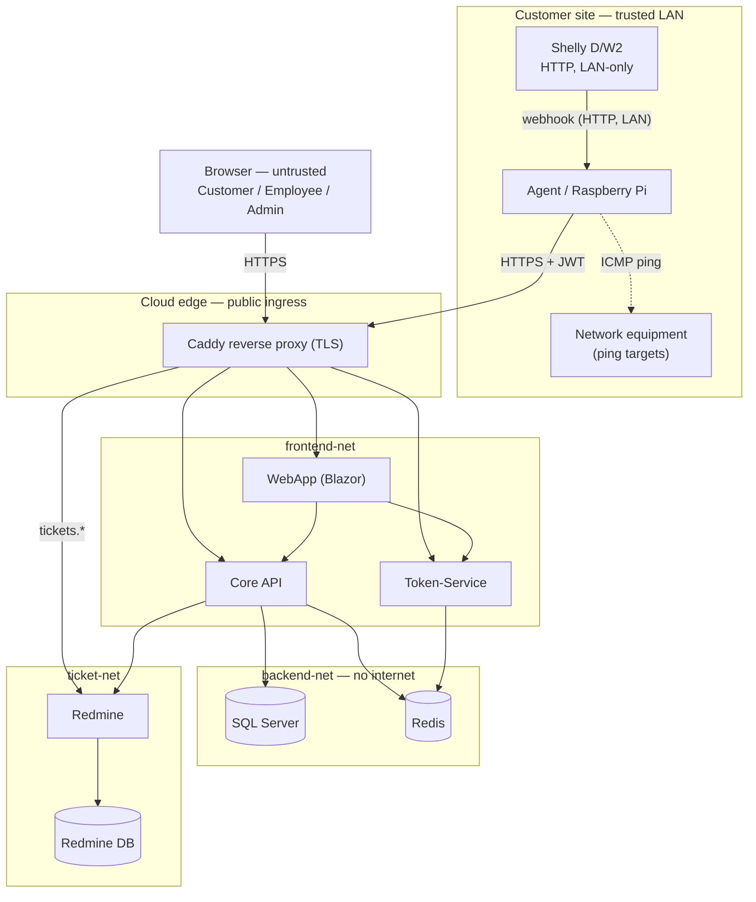

# Threat Model: ShellySpotter

We made this threat model using the four steps from the course
(*Introduction to threat modeling*):

1. Draw what the system does and what we want to protect.
2. Ask "what could possibly go wrong?" and list the threats (with the *how*).
3. Decide what to do with each one: avoid, reduce, transfer, or accept.
4. Build the important fixes and review the model now and then.

**In scope:** the four .NET services (Agent, Core, Token-Service, WebApp), their
data stores (SQL Server, Redis), the Redmine ticket system, and the network and
CI security around them.

**Out of scope (this iteration):** physical security of the Shelly device and the
Raspberry Pi, and the customer's local network. These sit at the customer site on
a physically controlled, trusted LAN.

---

## Step 1: What we protect

### How the system works

The Agent always starts the connection itself. It asks Core for its config and
sends its reports. Core can never call back into the customer's network, so the
customer's firewall needs no open incoming port.

### What is worth protecting

We also note which property matters most: **C**onfidentiality, **I**ntegrity,
**A**vailability.

- **Reliable monitoring and alerting (A + I).** The Agent → Core → ticket chain
  must actually raise an alert when a door opens or the temperature is too high.
  If it is silenced or down, a real event is missed. This is the core of the product.
- **Room data** — sensor and ping results **(C + I).** Only the owner should see
  it, and wrong data means wrong or missing alerts.
- **Customer configuration** — maintenance windows, temperature thresholds, ping
  targets **(I).** If tampered with, monitoring breaks silently.
- **User passwords (C)** — bcrypt hashes in Redis.
- **JWT signing secret (C)** — anyone who has it can forge any login or role.
- **The tokens themselves (C)** — a stolen token lets someone act as that user.
- **Database and Redis passwords (C).**
- **Redmine API key (C)** — grants access to the ticket system.
- **Alerts and tickets (I)** — our record of what happened.
- **Source code and build pipeline (I)** — supply-chain integrity.

### Trust boundaries (where data moves into something we trust more)

1. Internet → cloud edge (browser or Agent → Caddy): TLS and a JWT.
2. Cloud edge → frontend-net: services are only reachable through Caddy.
3. frontend-net → backend-net: only Core/Token reach SQL Server and Redis; these
   are not on the internet.
4. Shelly → Agent: plain HTTP, but only on the customer's own trusted LAN.
5. Caddy → Redmine (`tickets.*`): the ticket system must be internet-reachable,
   so it is exposed on purpose, behind TLS.

---

## Step 2 and 3: The threats and what we do

We went through the diagram with **STRIDE** and asked, for each part, "what could
go wrong, and *how*?". Each threat gets a decision. Accepting a small risk is fine
when fixing it is not worth it yet. The "what we do" column is meant to be
actionable: an open item should tell a developer what to build and how to check it.

| # | What could go wrong, and how | STRIDE | Decision | What we do about it |
|---|------------------------------|--------|----------|---------------------|
| 1 | An attacker without a valid Agent token calls Core's report endpoints directly (or grabs a token with a guessed/leaked Agent password) and pushes false sensor data, causing wrong or missing alerts | Spoofing | Reduce | Core only accepts a valid `Agent`-role JWT from the Token-Service; report endpoints use `[Authorize(Roles="Agent")]`. **To do:** keep the Agent password a strong env secret and rotate it. **Verify:** request without/with a wrong token → 401/403 |
| 2 | An attacker sends many login attempts (guessed or leaked username/password pairs) to `POST /api/auth/login`, because there is no rate limit, and takes over an account | Spoofing / DoS | Reduce | Passwords are bcrypt-hashed. **To do:** add per-IP rate limiting (AspNetCoreRateLimit) on the login endpoint, ~5/min then 429 + short lockout. File: TokenService `Program.cs`. **Verify:** 6th attempt in a minute → 429 |
| 3 | An attacker **steals** a valid JWT — via XSS in the WebApp (the token sits in `ProtectedSessionStorage`), sniffing an unencrypted link, or a token leaked in logs/URL | Spoofing / Info disclosure | Reduce | *Preventive:* tokens only over HTTPS, never in URLs or logs; Blazor auto-encodes output, add a CSP header in Caddy to limit XSS. **Verify:** no token appears in server logs or URLs; CSP header is present |
| 4 | An attacker **reuses** a stolen or copied token to call the API as that user before it expires | Spoofing | Reduce | 8 h expiry + logout puts the token's `jti` on a Redis blocklist; both services check it in `OnTokenValidated`. **Verify:** after logout the same token → 401 |
| 5 | An attacker puts SQL fragments into an API field (e.g. a filter parameter) to change the query and read or modify other tenants' data | Tampering / Info disclosure | Reduce | EF Core uses parameterized queries; no string-built SQL; input bound via validated DTOs. **Verify:** code-review for `FromSqlRaw`/interpolation; input `' OR 1=1 --` changes nothing |
| 6 | If the SQL Server were reachable from the internet, an attacker could connect directly with default/stolen credentials and read or change all data | Info disclosure / Tampering | Reduce | SQL Server is only on the internal `backend-net`, no host port published; only Core reaches it. **To do:** give the app its own least-privilege DB user instead of `sa`. **Verify:** `docker compose config` shows no published DB port; an external connection fails |
| 7 | A device on the customer LAN (or, with a firewall misconfig, from outside) calls the Agent's unprotected `GET /hook/door` and sends fake door/temperature events, causing false alarms or hiding a real intrusion | Spoofing / Tampering | Accept → Reduce | Accepted today: it only lives on the trusted LAN. **To do (Reduce):** require a shared-secret token in the webhook URL that only Shelly and the Agent know; the Agent drops requests without it. **Verify:** call without the token → 401 |
| 8 | An attacker on the path between Agent and Core reads or changes traffic (MITM), if TLS validation is misconfigured (the Agent accepts self-signed only in Development) | Tampering / Info disclosure | Reduce | HTTPS everywhere; certificate validation is enforced in production, self-signed only in Development. **Verify:** a production Agent against an invalid cert → connection fails |
| 9 | A user claims they did not create or close an alert | Repudiation | Reduce | We log the timestamp and the authenticated user; only staff (Employee/Admin) can resolve. **Verify:** each alert records `CreatedAt`/`ResolvedAt` + the user |
| 10 | A customer opens another customer's room by changing the `roomId` in the URL (the endpoint only checked that you are logged in, not that you own the room) | Info disclosure | Reduce | `RoomAccessService` checks ownership on every room-scoped endpoint. **Verify:** own room → 200, foreign room → 403 |
| 11 | The JWT signing secret or a DB/Redis password leaks — e.g. accidentally committed to git or printed in logs — letting an attacker forge tokens or read the DB | Info disclosure | Reduce | Secrets only in env vars / `.env` (git-ignored), never in code; TruffleHog `--only-verified` scans the tree in CI and fails on a real secret. **Verify:** CI fails on a planted live secret |
| 12 | An employee uses their legitimate global role to look at customer data they do not need for the task | Info disclosure | Accept | Small trusted team; role checks + actions are logged. Revisit (need-to-know, per-record access logs) if the team grows |
| 13 | An insider (Employee) creates a very wide maintenance window so a real after-hours door opening produces no alert or ticket, and the break-in goes unnoticed | Tampering / Repudiation | Reduce | *Preventive:* cap the maximum window length; creating/editing a window is Employee/Admin-only and is logged. *Detective:* log every door event even when the alert is suppressed (temperature alerts are deliberately never suppressed). **Verify:** a door event inside a window creates a log entry but no ticket |
| 14 | A door event opens a new ticket every few seconds (ticket spam) | Denial of service | Reduce | No new alert or ticket while one is already open for that room. **Verify:** repeated open events create one ticket, not many |
| 15 | A NuGet dependency has a known CVE that an attacker exploits through an exposed function | Tampering | Reduce | A CycloneDX SBOM is generated in CI. **To do:** add `dotnet list package --vulnerable` (or Dependabot) to CI and fail on a critical CVE. **Verify:** CI flags a deliberately outdated package |
| 16 | Redmine must be internet-reachable (spec); with default logins or unpatched, an attacker reads tickets or abuses the API key | Info disclosure / EoP | Reduce | Only behind Caddy/TLS; change the default admin immediately; API key kept as a secret; keep Redmine patched. **Verify:** no Redmine port published except via Caddy |
| 17 | A customer edits the `role` in their own token to become Admin | Elevation of priv. | Reduce | The role is a signed claim, so changing it breaks the signature. **Verify:** a token with a tampered role → 401 |

---

Last reviewed: 2026-06-26.
